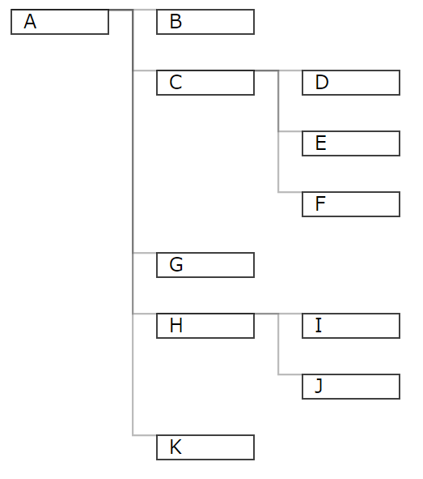

# マークダウンドキュメント管理

1. 番号付き
2. リスト

- 点のリスト
- だよ
  - インデントはタブ
  - スペースではインデント
    - 入らない

'インライン'

<!-- コメントアウト -->

| th左 | th中央 | th右 |
| :-- | :-: | --: |
| td | td | td |
| 内容があああ|長い　だ
|ないと||どうなる

**太字**

[var][変数]

[link]:変数2

[リンク][link]

*italic*

**太字**

|table|a|a|

- table
  - aa
  - aa

1. table 
   
2. 555
3. 
4. 
5. 